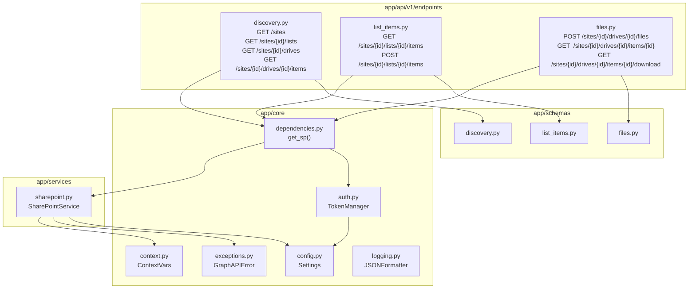
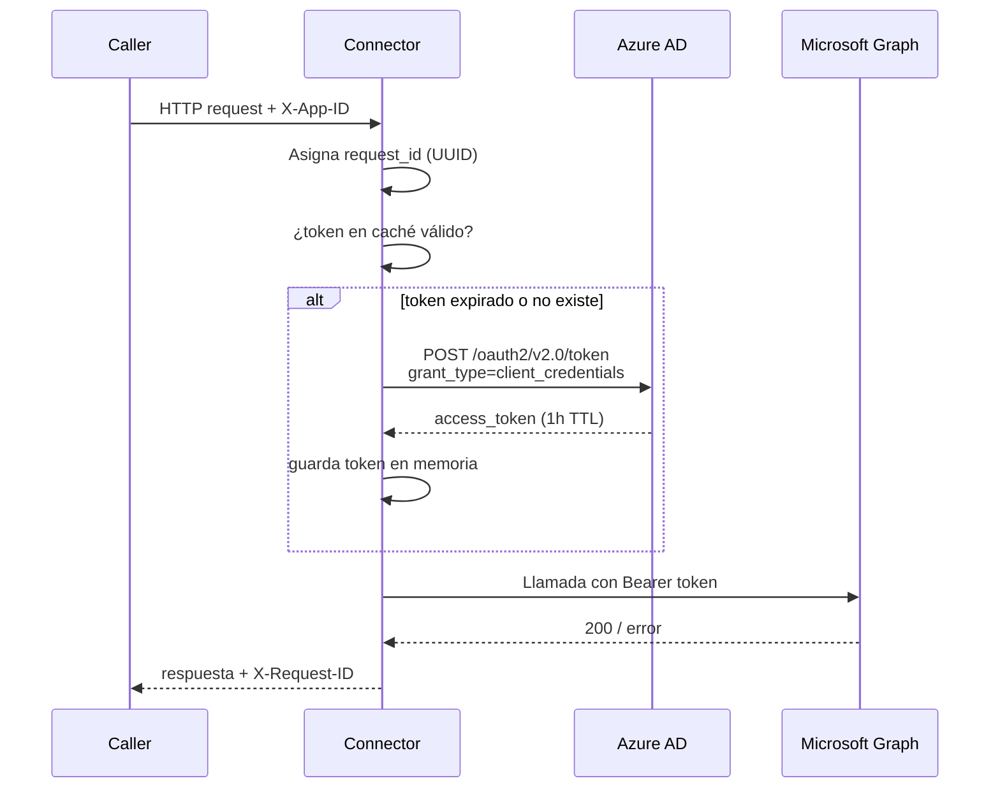

# Arquitectura: SharePoint Connector

**Versión:** 2.0.0  
**Fecha:** 2026-06-09  
**Autor:** Juan Camilo López Alzate — Latinia  

---

## 1. Contexto y motivación

La integración original entre **Jirito Newsletter** y **SharePoint** se realizaba a través de **Power Automate**, con dos limitaciones principales:

- Errores transitorios (408, 429, 5xx) no visibles en los logs, sin trazabilidad de fallos.
- Lógica de negocio fragmentada entre código y flujos visuales en plataforma externa.

**SharePoint Connector** elimina esta dependencia implementando la integración directamente sobre la **Microsoft Graph API**. La versión 2.0.0 amplía el alcance del servicio: en lugar de estar acoplado a un site concreto, expone una API genérica que opera sobre cualquier site, lista y biblioteca de documentos identificados dinámicamente en cada llamada.

---

## 2. Arquitectura actual

```mermaid
graph LR
    subgraph Caller["Caller (cualquier sistema)"]
        C[HTTP Client]
    end

    subgraph SPC["sharepoint-connector (Docker)"]
        MW[Middleware\nRequest ID · X-App-ID]
        API["API Layer\n/v1/graph/..."]
        DEP[Dependencies\nlru_cache singletons]
        SRV[SharePointService\nGraph API client]
        AUTH[TokenManager\nOAuth2 cache]
        CFG[Settings\npydantic-settings]
    end

    subgraph AAD["Azure AD"]
        TK[Token Endpoint\nclient_credentials]
    end

    subgraph GRAPH["Microsoft Graph API v1.0"]
        GS[/sites — Discovery]
        GL[/sites/{id}/lists — List Items]
        GF[/sites/{id}/drives — Files]
    end

    subgraph SP["SharePoint"]
        DL[(Biblioteca\nDocumentos)]
        LST[(Lista)]
    end

    C -->|HTTP + X-App-ID| MW
    MW --> API
    API --> DEP
    DEP --> SRV
    DEP --> AUTH
    AUTH -->|client_credentials| TK
    TK -->|Bearer token| AUTH
    SRV --> GS
    SRV --> GL
    SRV --> GF
    GS --> SP
    GL --> LST
    GF --> DL
    CFG --> AUTH
    CFG --> SRV
```

---

## 3. Componentes internos



### Descripción de módulos

| Módulo | Archivo | Responsabilidad |
|---|---|---|
| **FastAPI app** | `app/main.py` | Punto de entrada, middleware de logging, exception handlers |
| **Config** | `app/core/config.py` | Variables de entorno validadas con pydantic-settings |
| **TokenManager** | `app/core/auth.py` | Obtención y caché del token OAuth2 (client_credentials) |
| **Dependencies** | `app/core/dependencies.py` | Singletons inyectables via `lru_cache` (FastAPI DI) |
| **Exceptions** | `app/core/exceptions.py` | `GraphAPIError` y handlers de error para FastAPI |
| **Logging** | `app/core/logging.py` | `JSONFormatter` para logs estructurados en JSON |
| **Context** | `app/core/context.py` | `ContextVar`s para `request_id` y `client_app_id` |
| **Router v1** | `app/api/v1/router.py` | Agrupador de endpoints bajo prefijo `/v1` |
| **Discovery** | `app/api/v1/endpoints/discovery.py` | Endpoints de exploración (sites, listas, drives, carpetas) |
| **List Items** | `app/api/v1/endpoints/list_items.py` | Lectura y creación de ítems en listas |
| **Files** | `app/api/v1/endpoints/files.py` | Subida, metadata y descarga de archivos |
| **Schemas** | `app/schemas/` | Modelos Pydantic de request/response por dominio |
| **SharePointService** | `app/services/sharepoint.py` | Cliente HTTP de Graph API (GET, POST, PUT, descarga) |

---

## 4. API

Todos los endpoints están bajo el prefijo `/v1/graph`.

### Discovery

#### `GET /v1/graph/sites`

Lista todos los sites de SharePoint accesibles por la aplicación.

| Query param | Tipo | Default | Descripción |
|---|---|---|---|
| `search` | string | `*` | Palabra clave para filtrar por nombre o URL |

**Response 200:**
```json
{
  "sites": [
    { "id": "hostname,site-col-id,site-id", "name": "soporte", "displayName": "Soporte", "webUrl": "https://..." }
  ],
  "total": 1
}
```

---

#### `GET /v1/graph/sites/{site_id}/lists`

Lista todas las listas del site (incluidas listas de sistema).

**Response 200:**
```json
{
  "site_id": "...",
  "lists": [
    { "id": "uuid", "name": "Análisis Soporte", "displayName": "Análisis Soporte", "webUrl": "https://..." }
  ],
  "total": 1
}
```

---

#### `GET /v1/graph/sites/{site_id}/drives`

Lista las bibliotecas de documentos (drives) del site.

**Response 200:**
```json
{
  "site_id": "...",
  "drives": [
    { "id": "b!...", "name": "Documents", "driveType": "documentLibrary", "webUrl": "https://..." }
  ],
  "total": 1
}
```

---

#### `GET /v1/graph/sites/{site_id}/drives/{drive_id}/items`

Navega el árbol de carpetas y archivos de un drive.

| Query param | Tipo | Default | Descripción |
|---|---|---|---|
| `item_id` | string | null | ID de carpeta a listar. Omitir para listar la raíz |

**Response 200:**
```json
{
  "drive_id": "b!...",
  "parent_id": null,
  "items": [
    { "id": "...", "name": "DailyDelivery", "is_folder": true, "size": null, "webUrl": "..." }
  ],
  "total": 1
}
```

---

### List Items

#### `GET /v1/graph/sites/{site_id}/lists/{list_id}/items`

Lee ítems de una lista junto con sus valores de campo.

| Query param | Tipo | Default | Descripción |
|---|---|---|---|
| `top` | int | `20` | Número máximo de ítems a devolver (1–5000) |

**Response 200:**
```json
{
  "site_id": "...",
  "list_id": "...",
  "items": [
    { "id": "1", "fields": { "Title": "LATSUP-001", "organization": "Acme" }, "webUrl": "..." }
  ],
  "total": 1
}
```

---

#### `POST /v1/graph/sites/{site_id}/lists/{list_id}/items`

Inserta un nuevo ítem en la lista.

**Request:**
```json
{
  "fields": {
    "Title": "LATSUP-6585",
    "organization": "Acme Corp",
    "score": 9.5,
    "resolved": true
  }
}
```

> Los nombres de campo deben ser los **nombres internos** (internal name) de las columnas en SharePoint, no el nombre de visualización.

**Response 201:**
```json
{ "status": "created", "id": "42", "webUrl": "https://..." }
```

---

### Files

#### `POST /v1/graph/sites/{site_id}/drives/{drive_id}/files`

Sube un archivo a una biblioteca de documentos. El cuerpo es `multipart/form-data`.

| Query param | Tipo | Default | Descripción |
|---|---|---|---|
| `folder` | string | `""` | Subcarpeta destino (p.ej. `Areas/testing_empty/OnlyTest`) |

La carpeta se crea automáticamente si no existe.

**Response 201:**
```json
{
  "status": "uploaded",
  "id": "01ABC...",
  "name": "informe.json",
  "size": 2048,
  "webUrl": "https://...",
  "drive_path": "/drive/root:/DailyDelivery"
}
```

---

#### `GET /v1/graph/sites/{site_id}/drives/{drive_id}/items/{item_id}`

Devuelve metadatos de un archivo o carpeta.

**Response 200:**
```json
{
  "id": "01ABC...",
  "name": "informe.json",
  "size": 2048,
  "webUrl": "https://...",
  "mime_type": "application/json",
  "created_at": "2026-06-01T10:00:00Z",
  "modified_at": "2026-06-09T08:30:00Z",
  "download_url": "https://...pre-authenticated-url..."
}
```

El campo `download_url` es una URL pre-autenticada válida ~1 hora (sin token Bearer).

---

#### `GET /v1/graph/sites/{site_id}/drives/{drive_id}/items/{item_id}/download`

Descarga el contenido binario del archivo.

**Response 200:** bytes del archivo con `Content-Type` del MIME real y `Content-Disposition: attachment; filename="..."`.

---

### Health

#### `GET /health`

```json
{ "status": "ok", "service": "SharePoint Connector", "version": "2.0.0" }
```

---

### Cabeceras HTTP

| Cabecera | Dirección | Descripción |
|---|---|---|
| `X-App-ID` | Request | Identificador del caller. Se registra en todos los logs |
| `X-Request-ID` | Response | UUID generado por el middleware para trazabilidad |

### Códigos de error

| Código | Causa |
|---|---|
| `400` | Parámetro inválido o faltante |
| `401` | Fallo de autenticación con Microsoft Graph |
| `403` | Permisos insuficientes (site sin grant, permisos Graph incorrectos) |
| `404` | Recurso no encontrado en SharePoint |
| `429` | Rate limit de Microsoft Graph — reintentar más tarde |
| `500` | Error interno no controlado |
| `502` | Error inesperado devuelto por Microsoft Graph |

---

## 5. Autenticación y seguridad



### Modelo de permisos: `Sites.Read.All` / `Sites.ReadWrite.All`

El App Registration en Azure AD requiere los permisos de aplicación:

- **`Sites.Read.All`** — para discovery y lectura de listas/archivos.
- **`Sites.ReadWrite.All`** — para escritura (crear ítems, subir archivos).

Como alternativa más restrictiva se puede usar **`Sites.Selected`**, que limita el acceso a sites específicos. En ese caso, un administrador debe conceder acceso explícitamente:

```powershell
Connect-PnPOnline -Url "https://latinia.sharepoint.com" -Interactive

Grant-PnPAzureADAppSitePermission `
  -AppId "<CLIENT_ID>" `
  -DisplayName "SharePoint Connector" `
  -Site "https://latinia.sharepoint.com/sites/yoursite" `
  -Permissions Write
```

Si el grant no está concedido, Graph devuelve `403 Forbidden` — visible en los logs del conector con `request_id`.

---

## 6. Logging estructurado

Todos los logs se emiten en JSON por `stdout`, compatibles con cualquier stack de observabilidad (ELK, Loki, CloudWatch, etc.).

```json
{
  "timestamp": "2026-06-09T10:00:00.000Z",
  "level": "INFO",
  "logger": "app.services.sharepoint",
  "message": "Uploaded file 'informe.json' (2048 bytes) → drive b!... / site hostname,...",
  "module": "sharepoint",
  "function": "upload_file",
  "line": 167,
  "request_id": "a1b2c3d4-...",
  "client_app_id": "jirito-newsletter",
  "site_id": "hostname,...",
  "drive_id": "b!...",
  "file_name": "informe.json"
}
```

Campos estructurados disponibles: `request_id`, `client_app_id`, `method`, `path`, `status_code`, `duration_ms`, `site_id`, `list_id`, `drive_id`, `item_id`, `file_name`, `graph_url`, `graph_status`.

---

## 7. Despliegue

### Variables de entorno

| Variable | Requerida | Descripción | Ejemplo |
|---|---|---|---|
| `TENANT_ID` | Sí | ID del tenant Azure AD | `xxxxxxxx-...` |
| `CLIENT_ID` | Sí | ID del App Registration | `xxxxxxxx-...` |
| `CLIENT_SECRET` | Sí | Secreto del App Registration | `abc123~...` |
| `LOG_LEVEL` | No | Nivel de log (`DEBUG`/`INFO`/`WARNING`/`ERROR`) | `INFO` |
| `SP_PORT` | No | Puerto expuesto en el host | `8003` |

> La API opera siempre con `site_id`, `list_id` y `drive_id` pasados como path params en cada llamada. Obtener estos IDs es el primer paso mediante los endpoints de discovery.

### Arranque con Docker Compose

```bash
cp devops/.env.example devops/.env
# Editar devops/.env con los valores reales
docker compose -f devops/docker-compose.yml up -d --build
```

### Integración en una red Docker existente

```yaml
# docker-compose.yml del caller (p.ej. Jirito Newsletter)
services:
  app:
    networks:
      - sp-net

  sharepoint-connector:
    image: sharepoint-connector:latest
    env_file: .env.sp-connector
    networks:
      - sp-net

networks:
  sp-net:
    driver: bridge
```

El caller apunta a `http://sharepoint-connector:8003/v1/graph/...`.

---

## 8. Flujo típico de uso

```
1. GET /v1/graph/sites?search=soporte
   → obtener site_id

2. GET /v1/graph/sites/{site_id}/lists
   → obtener list_id

3. GET /v1/graph/sites/{site_id}/drives
   → obtener drive_id

4. POST /v1/graph/sites/{site_id}/lists/{list_id}/items
   → crear ítem en lista

5. POST /v1/graph/sites/{site_id}/drives/{drive_id}/files?folder=DailyDelivery
   → subir archivo (multipart/form-data)

6. GET /v1/graph/sites/{site_id}/drives/{drive_id}/items/{item_id}/download
   → descargar archivo
```

Los IDs de site, lista y drive son estables; solo es necesario hacer discovery una vez y cachear los resultados en el caller.

---

## 9. Comparativa con versión anterior (v1)

| Aspecto | v1.0.0 | v2.0.0 |
|---|---|---|
| **Endpoints** | `POST /upload`, `POST /list` | API REST versionada `/v1/graph/...` con 9 endpoints |
| **Scope** | Site único fijo (env var `SITE_URL`) | Multi-site dinámico — site/lista/drive en cada llamada |
| **Discovery** | No disponible | Endpoints para explorar sites, listas, drives y carpetas |
| **Subida de archivos** | JSON con `data` en Base64 | `multipart/form-data` — más eficiente y estándar |
| **Descarga de archivos** | No disponible | `GET .../download` — bytes directos con Content-Type |
| **Metadatos de archivo** | No disponible | `GET .../items/{item_id}` con `download_url` pre-autenticada |
| **Logging** | Básico | JSON estructurado con `request_id`, `client_app_id`, duración |
| **Trazabilidad** | Parcial | `X-Request-ID` en respuesta + contexto propagado a services |
| **Manejo de errores** | Genérico | `GraphAPIError` tipado con códigos 400/401/403/404/429/502 |
| **Estructura de módulos** | Plana (`app/*.py`) | Capas separadas: `core/`, `api/v1/`, `schemas/`, `services/` |

---

## 10. Limitaciones conocidas (v2)

| Limitación | Condición | Solución futura |
|---|---|---|
| Tamaño máximo de archivo | 4 MB (límite de `PUT .../content` en Graph) | Implementar upload sessions para archivos mayores |
| Sin paginación en discovery | Resultados truncados si hay >1000 sites/listas/drives | Implementar `@odata.nextLink` |
| Sin cola de reintentos | Fallo en Graph → error inmediato al caller | Añadir cola interna con reintentos exponenciales |
| Sin autenticación entre caller y conector | El servicio confía en cualquier caller en la red | Añadir API key o JWT en cabecera `X-Api-Key` |
| Token en memoria (no distribuido) | Una sola instancia — token no compartido entre réplicas | Externalizar caché de token (Redis) para alta disponibilidad |
