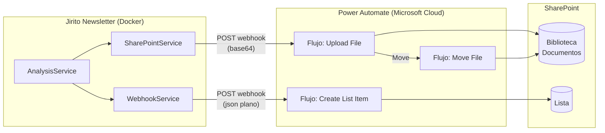
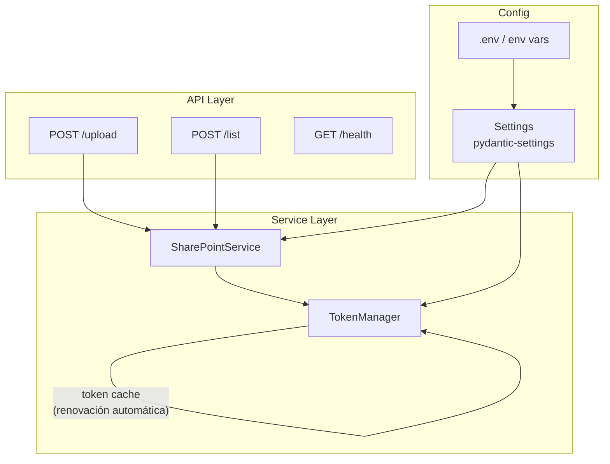
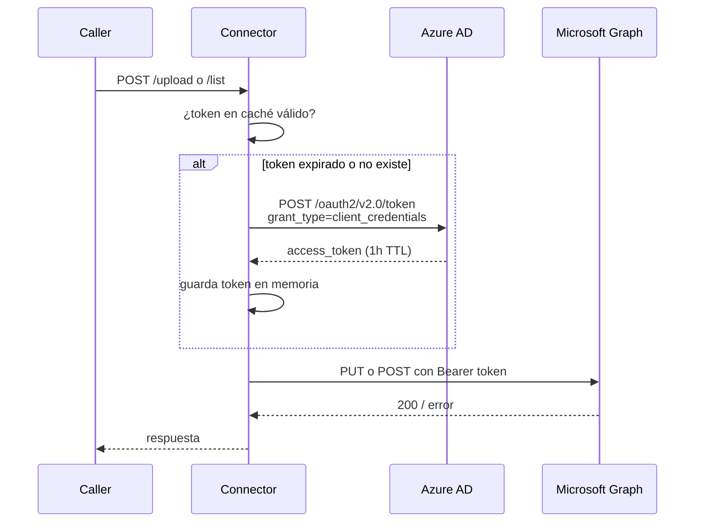

# Arquitectura: SharePoint Connector

**Versión:** 1.0.0  
**Fecha:** 2026-05-19  
**Autor:** Juan Camilo López Alzate — Latinia  

---

## 1. Contexto y motivación

La integración actual entre **Jirito Newsletter** y **SharePoint** se realiza a través de **Power Automate**, un orquestador de alto nivel de Microsoft que actúa como intermediario entre la aplicación y la API de SharePoint.

Esta aproximación presenta limitaciones operativas documentadas:

- El conector `Move File` no expone en el log del flujo los errores transitorios (408, 429, 5xx), impidiendo la trazabilidad de fallos.
- Los reintentos automáticos de Power Automate ocurren de forma opaca, sin visibilidad ni control por parte del equipo de desarrollo.
- La lógica de negocio queda fragmentada entre el código de la aplicación y flujos visuales en una plataforma externa.
- Cualquier cambio en el comportamiento del flujo requiere acceso y conocimiento de Power Automate, añadiendo una dependencia de plataforma innecesaria.

**SharePoint Connector** elimina esta dependencia implementando la integración directamente sobre la **Microsoft Graph API**, con control total sobre el ciclo de vida de cada operación.

---

## 2. Arquitectura actual (con Power Automate)



### Problemas observados

| Problema | Impacto |
|---|---|
| Errores 408/429/5xx no visibles en logs de PA | Sin trazabilidad de fallos |
| Reintentos opacos del conector `Move File` | Archivos no movidos sin diagnóstico posible |
| Dependencia de plataforma externa (PA) | Bloqueo operativo ante cambios o incidencias en PA |
| Lógica de negocio distribuida | Mayor coste de mantenimiento |

---

## 3. Arquitectura propuesta

```mermaid
graph LR
    subgraph Jirito["Jirito Newsletter (Docker)"]
        AS[AnalysisService]
        WS[WebhookService]
        SPS[SharePointService]
    end

    subgraph SPC["sharepoint-connector (Docker)"]
        API[FastAPI\nREST API]
        AUTH[TokenManager\nOAuth2 Cache]
        SRV[SharePointService\nGraph API]
    end

    subgraph AAD["Azure AD"]
        TK[Token Endpoint\nclient_credentials]
    end

    subgraph GRAPH["Microsoft Graph API"]
        GF[/sites/{id}/drives\nUpload file]
        GL[/sites/{id}/lists\nCreate item]
    end

    subgraph SP["SharePoint"]
        DL[(Biblioteca\nDocumentos)]
        LST[(Lista)]
    end

    AS --> WS
    AS --> SPS
    WS -->|"POST /list\n{fields: {...}}"| API
    SPS -->|"POST /upload\n{folder, filename, data}"| API
    API --> AUTH
    AUTH -->|client_id\nclient_secret\ntenant_id| TK
    TK -->|Bearer token| AUTH
    AUTH --> SRV
    SRV --> GF
    SRV --> GL
    GF --> DL
    GL --> LST
```

### Principios de diseño

1. **Módulo independiente** — el contenedor no pertenece a Jirito ni a ninguna aplicación concreta. Cualquier sistema puede invocarlo.
2. **Interfaz compatible** — los payloads son iguales o superconjunto de los que actualmente recibe Power Automate, minimizando el cambio en los callers.
3. **Genérico por diseño** — el endpoint `/list` acepta cualquier combinación de campos y tipos sin esquema fijo, adaptándose a cualquier lista de SharePoint.
4. **Trazabilidad total** — cada operación queda registrada con su código HTTP, payload y respuesta. Los errores de Graph API son visibles y propagados con detalle.

---

## 4. Componentes internos



### Descripción de módulos

| Módulo | Archivo | Responsabilidad |
|---|---|---|
| **FastAPI app** | `app/main.py` | Punto de entrada, routing, logging |
| **Config** | `app/config.py` | Variables de entorno con validación Pydantic |
| **TokenManager** | `app/auth.py` | Obtención y caché del token OAuth2 |
| **SharePointService** | `app/services/sharepoint.py` | Llamadas a Graph API (upload, list item) |
| **Models** | `app/models.py` | Esquemas de entrada Pydantic |
| **Dependencies** | `app/dependencies.py` | Singletons inyectables (FastAPI DI) |
| **Router /upload** | `app/routers/upload.py` | Endpoint de subida de archivos |
| **Router /list** | `app/routers/list_item.py` | Endpoint de creación de ítems en lista |

---

## 5. API

### `POST /upload`

Sube un archivo a una biblioteca de documentos de SharePoint.

**Request:**
```json
{
  "folder": "DailyDelivery/Old",
  "filename": "LATSUP-5734_20260511.json",
  "data": "<contenido en Base64>",
  "drive_name": "Documents"
}
```

| Campo | Tipo | Requerido | Descripción |
|---|---|---|---|
| `folder` | string | Sí | Ruta relativa dentro de la biblioteca |
| `filename` | string | Sí | Nombre del archivo destino |
| `data` | string | Sí | Contenido del archivo en Base64 |
| `drive_name` | string | No | Biblioteca de documentos (default: `DEFAULT_DRIVE_NAME`) |
| `token` | string | No | Ignorado — compatibilidad con callers de PA |

**Response 200:**
```json
{
  "status": "ok",
  "id": "01ABC...",
  "name": "LATSUP-5734_20260511.json",
  "webUrl": "https://latinia.sharepoint.com/sites/..."
}
```

---

### `POST /list`

Crea un ítem en una lista de SharePoint. Acepta cualquier combinación de campos y tipos de dato.

**Request:**
```json
{
  "list_name": "Análisis Soporte",
  "fields": {
    "Title": "LATSUP-6585",
    "organization": "Acme Corp",
    "value_analysis_cliente": "8",
    "score": 9.5,
    "resolved": true,
    "tags": ["soporte", "crítico"]
  }
}
```

| Campo | Tipo | Requerido | Descripción |
|---|---|---|---|
| `list_name` | string | No | Nombre de la lista SP (default: `DEFAULT_LIST_NAME`) |
| `fields` | `dict[str, Any]` | Sí | Campos del ítem. Acepta `str`, `int`, `float`, `bool`, `list` |
| `token` | string | No | Ignorado — compatibilidad con callers de PA |

> Los nombres de campo deben ser los **nombres internos** (internal name) de las columnas en SharePoint, no el nombre de visualización.

**Response 200:**
```json
{
  "status": "ok",
  "id": "42"
}
```

---

### `GET /health`

```json
{ "status": "ok" }
```

---

### Códigos de error

| Código | Causa |
|---|---|
| `400` | Parámetro inválido o faltante (`list_name` no configurado, drive no encontrado) |
| `502` | Error en la llamada a Graph API (incluye el mensaje original de Microsoft) |

---

## 6. Seguridad y autenticación



### Modelo de permisos: `Sites.Selected`

El App Registration en Azure AD tiene el permiso **`Sites.Selected`**, el más restrictivo disponible para aplicaciones de servidor. A diferencia de `Sites.ReadWrite.All`, este permiso:

- **No concede acceso a ningún site por defecto.**
- Requiere que un administrador de SharePoint conceda acceso explícitamente a cada site mediante la Graph API o PowerShell.
- Limita el radio de impacto ante una brecha de credenciales.

**Comando de activación (ejecutar una sola vez por un administrador):**

```powershell
# Requiere módulo PnP.PowerShell
Connect-PnPOnline -Url "https://latinia.sharepoint.com" -Interactive

Grant-PnPAzureADAppSitePermission `
  -AppId "<CLIENT_ID>" `
  -DisplayName "SharePoint Connector" `
  -Site "https://latinia.sharepoint.com/sites/yoursite" `
  -Permissions Write
```

Si el grant no está concedido, Graph devuelve `403 Forbidden` con mensaje explícito — trazable en los logs del conector.

---

## 7. Despliegue

### Variables de entorno

| Variable | Descripción | Ejemplo |
|---|---|---|
| `TENANT_ID` | ID del tenant Azure AD | `xxxxxxxx-...` |
| `CLIENT_ID` | ID del App Registration | `xxxxxxxx-...` |
| `CLIENT_SECRET` | Secreto del App Registration | `abc123~...` |
| `SITE_URL` | URL del site SharePoint con grant | `https://latinia.sharepoint.com/sites/soporte` |
| `DEFAULT_LIST_NAME` | Lista por defecto (opcional) | `Análisis Soporte` |
| `DEFAULT_DRIVE_NAME` | Biblioteca por defecto | `Documents` |
| `SP_PORT` | Puerto expuesto en el host | `8001` |

### Arranque con Docker Compose

```bash
cp .env.example .env
# Editar .env con los valores reales
docker compose up -d --build
```

### Integración en una red Docker existente

Si el caller (p.ej. Jirito Newsletter) corre en la misma red Docker, el conector es accesible por nombre de servicio sin exponer puertos al exterior:

```yaml
# docker-compose.yml del caller
services:
  app:
    networks:
      - sp-net

  sharepoint-connector:
    image: sharepoint-connector:latest
    env_file: .env.sp-connector
    networks:
      - sp-net

networks:
  sp-net:
    driver: bridge
```

El caller apunta a `http://sharepoint-connector:8000/upload` en lugar de la URL de Power Automate.

---

## 8. Migración desde Power Automate

El cambio en Jirito Newsletter se reduce a **una línea** por operación: reemplazar la URL del webhook.

### En `WebhookService` (creación de ítems en lista)

```python
# Antes
payload = {
    "organization": ...,
    "issue": ...,
    "value_analysis_cliente": ...,
    # ... campos planos directo a PA
}
requests.post(pa_webhook_url, json=payload)

# Después
payload = {
    "list_name": "Análisis Soporte",   # opcional si está configurado por defecto
    "fields": {
        "organization": ...,
        "issue": ...,
        "value_analysis_cliente": ...,
        # ... mismos campos
    }
}
requests.post("http://sharepoint-connector:8000/list", json=payload)
```

### En `SharePointService` (subida de archivos)

```python
# Antes — payload a PA
payload = {"token": ..., "folder": ..., "filename": ..., "data": ...}
requests.post(pa_upload_url, json=payload)

# Después — mismo payload, nueva URL
requests.post("http://sharepoint-connector:8000/upload", json=payload)
```

El campo `token` sigue funcionando (se acepta y se ignora), por lo que el payload no necesita cambiar.

---

## 9. Comparativa

| Aspecto | Power Automate | SharePoint Connector |
|---|---|---|
| **Trazabilidad de errores** | Parcial — 408/429/5xx no visibles | Total — código HTTP + mensaje en logs |
| **Control de reintentos** | Automático y opaco | Implementable con lógica propia |
| **Dependencia de plataforma** | Microsoft Power Automate | Solo Microsoft Graph (API estándar) |
| **Mantenimiento** | Flujos visuales en portal externo | Código Python en el mismo repo |
| **Genericidad** | Flujo fijo por caso de uso | Un servicio para cualquier app |
| **Coste** | Licencia Power Automate | Coste de infraestructura Docker |
| **Latencia** | Variable (flujo cloud) | Directa a Graph API |
| **Permisos** | Configurados en el conector PA | `Sites.Selected` — mínimo privilegio |

---

## 10. Limitaciones conocidas (v1)

| Limitación | Condición | Solución futura |
|---|---|---|
| Tamaño máximo de archivo | 4 MB (límite de `PUT .../content` en Graph) | Implementar upload sessions para archivos mayores |
| Site único | Un site por instancia del conector | Múltiples instancias o soporte multi-site |
| Sin cola de reintentos | Fallo en Graph → error inmediato al caller | Añadir cola interna con reintentos exponenciales |
| Sin autenticación entre caller y conector | El servicio confía en cualquier caller en la red | Añadir API key o JWT en cabecera `X-Api-Key` |
