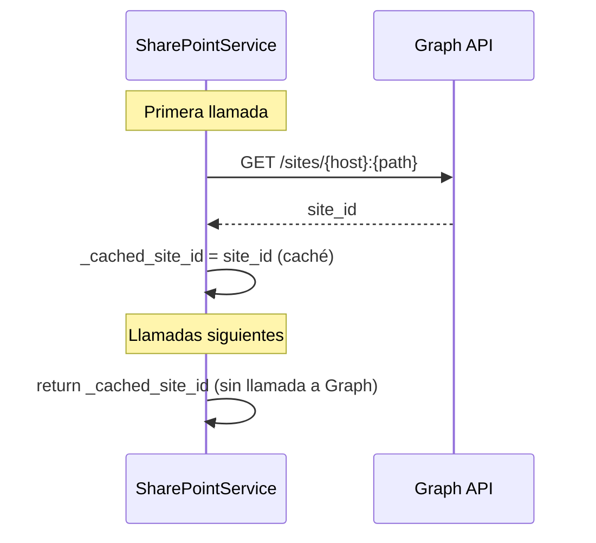

# Tecnologías utilizadas — SharePoint Connector

**Versión:** 1.0.0  
**Fecha:** 2026-05-20  
**Autor:** Juan Camilo López Alzate — Latinia  

---

## Índice

1. [Visión general del stack](#1-visión-general-del-stack)
2. [Python 3.12](#2-python-312)
3. [FastAPI](#3-fastapi)
4. [Pydantic y pydantic-settings](#4-pydantic-y-pydantic-settings)
5. [httpx](#5-httpx)
6. [Uvicorn](#6-uvicorn)
7. [Microsoft Graph API](#7-microsoft-graph-api)
8. [OAuth 2.0 — Client Credentials Flow](#8-oauth-20--client-credentials-flow)
9. [Permiso Sites.Selected](#9-permiso-sitesselected)
10. [Docker y Docker Compose](#10-docker-y-docker-compose)
11. [Decisiones descartadas](#11-decisiones-descartadas)

---

## 1. Visión general del stack

```
┌─────────────────────────────────────────────────────┐
│                  Docker Container                   │
│                                                     │
│  ┌──────────┐   ┌──────────┐   ┌─────────────────┐ │
│  │ Uvicorn  │ → │ FastAPI  │ → │ SharePointSvc   │ │
│  │  ASGI    │   │  Router  │   │  (httpx async)  │ │
│  └──────────┘   └──────────┘   └────────┬────────┘ │
│                                         │           │
│  ┌──────────────────────────────────────┘           │
│  │  Pydantic (modelos)  ·  pydantic-settings (env)  │
│  └──────────────────────────────────────────────────┘
└─────────────────────────────────────────────────────┘
         │ HTTPS
         ▼
┌─────────────────────────┐
│   Azure AD              │
│   OAuth2 token endpoint │
└────────────┬────────────┘
             │ Bearer token
             ▼
┌─────────────────────────┐
│   Microsoft Graph API   │
│   /sites / /drives      │
│   /lists / /items       │
└────────────┬────────────┘
             │
             ▼
┌─────────────────────────┐
│   SharePoint Online     │
└─────────────────────────┘
```

| Capa | Tecnología | Versión |
|---|---|---|
| Lenguaje | Python | 3.12 |
| Framework web | FastAPI | ≥ 0.115 |
| Validación de datos | Pydantic | ≥ 2.11 |
| Configuración | pydantic-settings | ≥ 2.7 |
| Cliente HTTP | httpx | ≥ 0.28 |
| Servidor ASGI | Uvicorn | ≥ 0.30 |
| API de integración | Microsoft Graph API | v1.0 |
| Autenticación | OAuth 2.0 Client Credentials | RFC 6749 |
| Contenerización | Docker + Docker Compose | — |

---

## 2. Python 3.12

### Qué es
Python es un lenguaje de programación interpretado, de tipado dinámico y sintaxis concisa. La versión 3.12 es la versión estable actual con mejoras de rendimiento respecto a versiones anteriores.

### Por qué se eligió
- Es el mismo lenguaje que usa Jirito Newsletter, lo que facilita el mantenimiento por el mismo equipo.
- El ecosistema de librerías para integración con APIs REST (httpx, Pydantic) es maduro y bien mantenido.
- Las anotaciones de tipo (`str | None`, `dict[str, Any]`) permiten validación estática sin sacrificar agilidad.

### Cómo se usa en el proyecto
- Todo el código del servicio está escrito en Python 3.12.
- Se usan type hints en todos los módulos para mejorar la legibilidad y la detección temprana de errores.

### Características de Python 3.12 aprovechadas
| Característica | Uso en el proyecto |
|---|---|
| `str \| None` (union types) | Campos opcionales en modelos Pydantic |
| `dict[str, Any]` genérico | Tipado del campo `fields` en `ListPayload` |
| `asyncio` nativo | Soporte async/await en toda la capa de servicio |

---

## 3. FastAPI

### Qué es
FastAPI es un framework web moderno para construir APIs REST con Python. Está basado en los estándares **OpenAPI** y **JSON Schema**, y usa `asyncio` de forma nativa para manejar concurrencia sin bloqueo.

**Repositorio oficial:** https://fastapi.tiangolo.com

### Por qué se eligió

| Criterio | FastAPI | Flask | Django REST |
|---|---|---|---|
| Soporte async nativo | Sí | Limitado | Limitado |
| Validación automática | Sí (Pydantic) | Manual | Parcial |
| Documentación automática | Sí (Swagger/Redoc) | No | No |
| Peso de la librería | Ligero | Ligero | Pesado |
| Curva de aprendizaje | Baja | Muy baja | Alta |

FastAPI genera automáticamente documentación interactiva en `/docs` (Swagger UI) y `/redoc`, lo que facilita las pruebas sin necesidad de herramientas externas como Postman.

### Cómo se usa en el proyecto

```python
# app/main.py
app = FastAPI(title="SharePoint Connector", version="1.0.0")
app.include_router(upload.router)
app.include_router(list_item.router)
```

- Cada endpoint (`/upload`, `/list`, `/health`) está definido en un router independiente.
- FastAPI valida automáticamente el JSON de entrada contra los modelos Pydantic antes de llegar al handler.
- Si el JSON no cumple el esquema, devuelve `422 Unprocessable Entity` con detalle del campo inválido — sin escribir una sola línea de validación manual.

### Documentación automática

Una vez levantado el contenedor, la documentación interactiva está disponible en:
- `http://localhost:8003/docs` — Swagger UI
- `http://localhost:8003/redoc` — ReDoc

---

## 4. Pydantic y pydantic-settings

### Qué es
**Pydantic** es una librería de validación de datos basada en type hints de Python. Convierte y valida datos de entrada (JSON, dicts) en objetos Python tipados, rechazando datos inválidos con mensajes de error descriptivos.

**pydantic-settings** es una extensión que permite leer configuración desde variables de entorno y archivos `.env` con la misma mecánica de validación.

### Por qué se eligió
- FastAPI usa Pydantic internamente, por lo que no añade dependencias extra.
- Permite definir el esquema de la API y la validación en un solo lugar (el modelo), sin duplicar lógica.
- El campo `fields: dict[str, Any]` en `ListPayload` es posible gracias a la flexibilidad de Pydantic con tipos genéricos.

### Cómo se usa en el proyecto

**Modelos de entrada (app/models.py):**
```python
class ListPayload(BaseModel):
    token: Optional[str] = None   # campo opcional, ignorado
    list_name: Optional[str] = None
    fields: dict[str, Any]        # acepta cualquier tipo
```

Pydantic acepta en `fields` valores de tipo `str`, `int`, `float`, `bool` y `list` sin configuración adicional — simplemente los pasa tal cual a Graph API.

**Configuración desde entorno (app/config.py):**
```python
class Settings(BaseSettings):
    model_config = SettingsConfigDict(env_file=".env")

    tenant_id: str          # obligatorio — falla al arrancar si no está
    client_id: str          # obligatorio
    client_secret: str      # obligatorio
    site_url: str           # obligatorio
    default_list_name: str = ""        # opcional con default
    default_drive_name: str = "Documents"
```

Si una variable obligatoria no está definida en el entorno, el servicio **falla al arrancar** con un mensaje claro indicando qué falta — evitando arranques en estado inconsistente.

---

## 5. httpx

### Qué es
`httpx` es un cliente HTTP para Python que soporta tanto llamadas síncronas como **asíncronas** (async/await), con una API muy similar a la popular librería `requests`.

**Repositorio oficial:** https://www.python-httpx.org

### Por qué se eligió frente a `requests`

| Criterio | httpx | requests |
|---|---|---|
| Soporte async | Sí (`AsyncClient`) | No |
| HTTP/2 | Sí | No |
| API similar a requests | Sí | — |
| Soporte en FastAPI | Recomendado | Compatible pero bloqueante |

El servicio usa `async/await` en toda la capa de llamadas a Graph API. Usar `requests` (síncrono) dentro de un handler async bloquearía el event loop de Python, degradando el rendimiento bajo carga. `httpx.AsyncClient` resuelve esto de forma nativa.

### Cómo se usa en el proyecto

```python
# app/services/sharepoint.py
_TIMEOUT = httpx.Timeout(60.0)  # uploads pueden llegar a 4 MB sobre SharePoint

async def _get(self, url: str) -> dict:
    async with httpx.AsyncClient(timeout=_TIMEOUT) as c:
        r = await c.get(url, headers=await self._headers())
        r.raise_for_status()   # lanza excepción en 4xx/5xx con el cuerpo del error
        return r.json()
```

El método `raise_for_status()` propaga el error HTTP original de Graph API (incluyendo su mensaje), que el router captura y devuelve al caller con código `502`.

---

## 6. Uvicorn

### Qué es
Uvicorn es un servidor ASGI (*Asynchronous Server Gateway Interface*) de alto rendimiento para Python. Es el servidor de producción recomendado para FastAPI.

**ASGI** es el estándar moderno para servidores web Python con soporte nativo de concurrencia asíncrona, sucesor de WSGI (usado por Flask/Django).

### Por qué se eligió
- Es la combinación estándar y recomendada con FastAPI.
- Soporta `asyncio` de forma nativa, aprovechando el modelo async del servicio.
- Arranque inmediato y sin configuración compleja.

### Cómo se usa en el proyecto

```dockerfile
# Dockerfile
CMD ["uvicorn", "app.main:app", "--host", "0.0.0.0", "--port", "8003"]
```

Se ejecuta con un único worker porque el `TokenManager` y las cachés de IDs de SharePoint viven en memoria del proceso. Múltiples workers crearían instancias independientes, duplicando llamadas de resolución innecesarias. Para escalar horizontalmente, se añaden réplicas del contenedor completo.

---

## 7. Microsoft Graph API

### Qué es
Microsoft Graph API es la API REST unificada de Microsoft para acceder a datos y servicios de Microsoft 365: SharePoint, OneDrive, Teams, Outlook, Azure AD, entre otros.

**Documentación oficial:** https://learn.microsoft.com/en-us/graph/overview  
**Versión usada:** `v1.0` (versión estable)

### Por qué se eligió frente a la SharePoint REST API clásica

| Criterio | Graph API v1.0 | SharePoint REST (`_api/`) |
|---|---|---|
| Autenticación moderna | OAuth2 (Azure AD) | OAuth2 + cookies legacy |
| Endpoint unificado | `graph.microsoft.com` | Por tenant/site |
| Soporte futuro | Activo (Microsoft) | Mantenimiento mínimo |
| Compatibilidad con `Sites.Selected` | Sí | Parcial |
| Documentación | Extensa y actualizada | Dispersa |

### Endpoints utilizados

#### Resolución de site
```
GET https://graph.microsoft.com/v1.0/sites/{hostname}:{site-path}
```
Devuelve el `id` interno del site, necesario para todas las operaciones posteriores. Se cachea en memoria tras la primera llamada.

#### Resolución de biblioteca de documentos
```
GET https://graph.microsoft.com/v1.0/sites/{site-id}/drives
```
Lista las bibliotecas disponibles. Se filtra por nombre y se cachea el `id`.

#### Subida de archivo
```
PUT https://graph.microsoft.com/v1.0/sites/{site-id}/drives/{drive-id}/root:/{folder}/{filename}:/content
```
Cuerpo: bytes del archivo (`Content-Type: application/octet-stream`).  
Si el archivo ya existe, lo sobreescribe. Si no existe, lo crea junto con las carpetas intermedias que sean necesarias.

#### Resolución de lista
```
GET https://graph.microsoft.com/v1.0/sites/{site-id}/lists/{list-name}
```
Acepta el nombre visible de la lista o su ID. Se cachea tras la primera llamada.

#### Creación de ítem en lista
```
POST https://graph.microsoft.com/v1.0/sites/{site-id}/lists/{list-id}/items
Content-Type: application/json

{
  "fields": {
    "Title": "LATSUP-6585",
    "CustomField": "valor"
  }
}
```
Graph API espera nativamente el wrapper `{"fields": {...}}`, por lo que el diseño del endpoint `/list` del conector es un reflejo directo de la API de Microsoft.

### Caché de IDs



Site ID, Drive ID y List ID se resuelven una sola vez por vida del proceso y se guardan en memoria. Esto reduce la latencia y el número de llamadas a Graph API.

---

## 8. OAuth 2.0 — Client Credentials Flow

### Qué es
OAuth 2.0 es el protocolo estándar de autorización para APIs modernas (RFC 6749). El **Client Credentials Flow** es la variante diseñada para comunicaciones **servidor a servidor** (sin usuario interactivo), donde una aplicación se autentica con su propia identidad.

### Flujo de autenticación

```
sharepoint-connector                Azure AD
        │                               │
        │  POST /oauth2/v2.0/token      │
        │  client_id=...                │
        │  client_secret=...            │
        │  grant_type=client_credentials│
        │  scope=graph.microsoft.com/.d │
        │──────────────────────────────▶│
        │                               │
        │  { access_token, expires_in } │
        │◀──────────────────────────────│
        │                               │
        │  GET/POST graph.microsoft.com │
        │  Authorization: Bearer <token>│
        │──────────────────────────────▶ Graph API
```

### Token cache en el conector

El `TokenManager` implementa una caché simple en memoria:

```python
async def get_token(self) -> str:
    # Reutiliza el token si aún es válido (con margen de 60s)
    if self._token and time.time() < self._expires_at - 60:
        return self._token
    # Si no, obtiene uno nuevo de Azure AD
    ...
```

Los tokens de Azure AD tienen un TTL de **3600 segundos (1 hora)**. El conector los renueva automáticamente cuando quedan menos de 60 segundos para expirar, evitando que una llamada en curso use un token ya expirado.

### Credenciales requeridas

| Parámetro | Dónde obtenerlo |
|---|---|
| `TENANT_ID` | Azure Portal → Azure Active Directory → Overview |
| `CLIENT_ID` | Azure Portal → App Registrations → tu app → Application (client) ID |
| `CLIENT_SECRET` | Azure Portal → App Registrations → tu app → Certificates & secrets |

---

## 9. Permiso Sites.Selected

### Qué es
`Sites.Selected` es un tipo de permiso de aplicación de Microsoft Graph que permite conceder acceso a **sites específicos de SharePoint**, en lugar de a todos los sites del tenant (como haría `Sites.ReadWrite.All`).

### Por qué es importante

```
Sites.ReadWrite.All         Sites.Selected
        │                         │
        ▼                         ▼
  Acceso a TODOS           Acceso solo a
  los sites del            los sites
  tenant                   explícitamente
                           autorizados
```

Con `Sites.Selected`, si las credenciales del conector se comprometieran, el atacante solo podría acceder a los sites autorizados, no a todo el SharePoint de la organización.

### Cómo se activa

El permiso `Sites.Selected` se declara en el App Registration en Azure AD, pero **no otorga acceso por sí solo**. Un administrador de SharePoint debe conceder acceso explícitamente a cada site:

```powershell
# Usando PnP.PowerShell
Grant-PnPAzureADAppSitePermission `
  -AppId "<CLIENT_ID>" `
  -DisplayName "SharePoint Connector" `
  -Site "https://latinia.sharepoint.com/sites/yoursite" `
  -Permissions Write
```

Niveles de permiso disponibles:

| Nivel | Capacidades |
|---|---|
| `Read` | Solo lectura de archivos y listas |
| `Write` | Lectura y escritura (suficiente para este servicio) |
| `FullControl` | Administración completa del site |

### Verificación

Para confirmar que el grant está activo:

```powershell
Get-PnPAzureADAppSitePermission -AppIdentity "<CLIENT_ID>"
```

---

## 10. Docker y Docker Compose

### Qué es
**Docker** es una plataforma de contenerización que empaqueta una aplicación junto con todas sus dependencias en una unidad portable llamada *contenedor*. Los contenedores son aislados del sistema operativo anfitrión y entre sí.

**Docker Compose** es una herramienta para definir y gestionar múltiples contenedores como un servicio único, usando un archivo YAML.

### Por qué se eligió
- Garantiza que el servicio se comporta igual en desarrollo, pruebas y producción.
- Elimina el problema de dependencias del sistema operativo anfitrión.
- Permite integrar el conector en una red Docker existente (p.ej. Jirito Newsletter) con comunicación interna por nombre de servicio.
- Cumple el requisito de Jimmy: el servicio debe ser independiente y portable.

### Estructura del Dockerfile

```dockerfile
FROM python:3.12-slim          # imagen base mínima (~50 MB vs ~900 MB de la completa)

WORKDIR /app

COPY requirements.txt .
RUN pip install --no-cache-dir -r requirements.txt  # dependencias en capa separada

COPY app/ ./app/               # código fuente en la última capa (más frecuentemente cambia)

EXPOSE 8003

HEALTHCHECK ...                # Docker comprueba que el servicio responde

CMD ["uvicorn", "app.main:app", "--host", "0.0.0.0", "--port", "8003"]
```

El orden de las instrucciones está optimizado para **aprovechar la caché de capas de Docker**: las dependencias (que cambian poco) se instalan antes que el código fuente (que cambia frecuentemente). Así, un rebuild tras un cambio de código no reinstala las dependencias.

### Healthcheck

```yaml
healthcheck:
  test: ["CMD", "python", "-c", "import urllib.request; urllib.request.urlopen('http://localhost:8003/health')"]
  interval: 30s
  timeout: 10s
  start_period: 15s
  retries: 3
```

Docker comprueba cada 30 segundos que el servicio responde en `/health`. Si falla 3 veces consecutivas, Docker marca el contenedor como `unhealthy`, lo cual puede disparar alertas o reinicios según la política de orquestación.

### Integración con red Docker de Jirito

Cuando ambos servicios están en la misma red Docker, el conector es accesible por nombre de servicio sin exponer puertos al host:

```
jirito-app ──▶ http://sharepoint-connector:8003/upload
               (resolución DNS interna de Docker)
```

Esto evita exposición innecesaria del conector a la red exterior.

---

## 11. Decisiones descartadas

### SDK oficial de Microsoft (`msal`, `msgraph-sdk-python`)

Microsoft ofrece librerías oficiales para Python:
- `msal`: manejo de autenticación OAuth2
- `msgraph-sdk-python`: cliente tipado para Graph API

**Por qué se descartaron:** añaden complejidad y dependencias para un conjunto reducido de operaciones (upload file + create list item). Con `httpx` y el flujo OAuth2 implementado directamente, el servicio tiene cero dependencias de SDKs de terceros de Microsoft, menor superficie de actualización y total control sobre las llamadas HTTP.

### SharePoint REST API clásica (`_api/`)

La API REST clásica de SharePoint (disponible en `https://tenant.sharepoint.com/sites/site/_api/`) es una alternativa viable pero presenta desventajas:

- No funciona bien con `Sites.Selected` en todos los escenarios.
- Requiere el endpoint específico por tenant/site, complicando la configuración.
- Microsoft la mantiene en modo legacy, con menor inversión en documentación y nuevas funcionalidades.

### Cola de mensajes (Redis, RabbitMQ)

Se evaluó añadir una cola de mensajes para desacoplar el caller del conector y gestionar reintentos de forma asíncrona. Se descartó para v1 por:

- Añade infraestructura adicional que aumenta la complejidad operativa.
- El volumen de operaciones actual no justifica el overhead.
- Está identificado como mejora futura en `ARQUITECTURA.md §10`.

### Base de datos de auditoría

Se consideró persistir cada operación (timestamp, payload, respuesta, código HTTP) en SQLite para trazabilidad histórica. Se descartó para v1 porque:

- Los logs de Uvicorn ya capturan esta información.
- Añade estado al contenedor, complicando los reinicios y la gestión de volúmenes.
- Se puede añadir de forma incremental sin cambiar la API.
