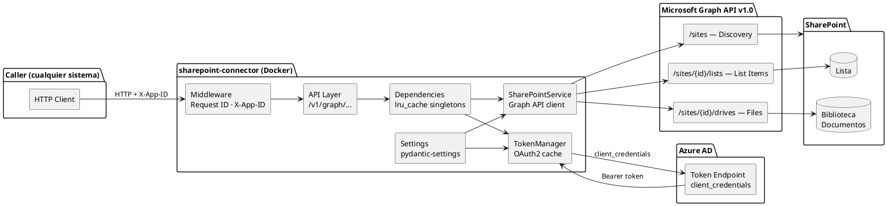
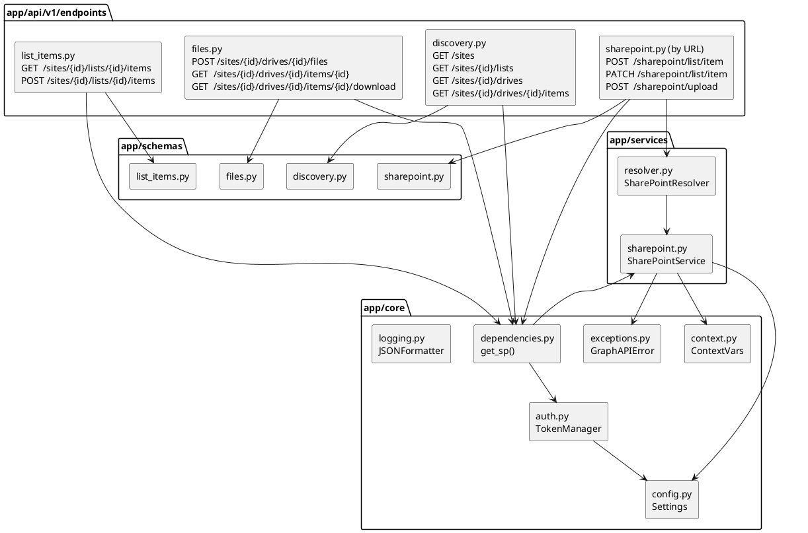
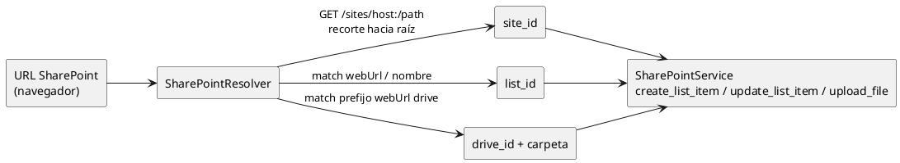
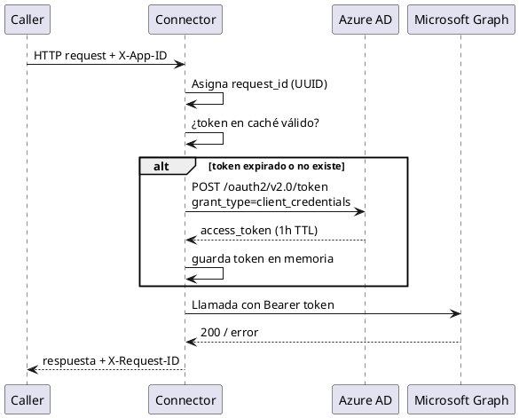

# Diagramas de Arquitectura (PlantUML): SharePoint Connector

**Versión:** 2.2.0
**Fecha:** 2026-06-10
**Autor:** Juan Camilo López Alzate — Latinia

> Versión en **PlantUML** de los diagramas de [`ARQUITECTURA.md`](ARQUITECTURA.md).
> Cada bloque puede renderizarse en [plantuml.com](https://www.plantuml.com/plantuml),
> con la extensión *PlantUML* de VS Code, o con el CLI `plantuml diagrama.puml`.

---

## 2. Arquitectura actual

---

## 3. Componentes internos

---

## 4. Capa de resolución de URL (`SharePointResolver`)

---

## 5. Autenticación y seguridad

